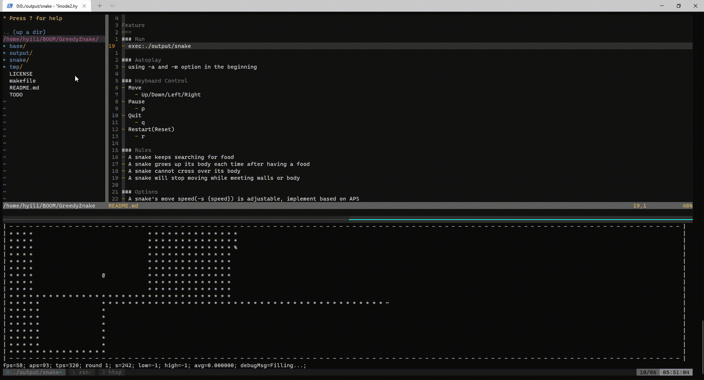

GreedyZnake on Terminal GameBoard
===
#### A group of greedy snake gaming AI on ncurses-based gameboard framework using C++. How greedy are you?
#### https://github.com/hyili/GreedyZnake.git


### Demo
Building process is deprecated, for the latest building instructions, please refers to [Building Process](#How-to-build)



### Programming Language & Prerequisition
Written in C++(C++11) Ncurses library

### How to build
```
# cd {Project_Root}
# aclocal
# autoconf
# automake --add-missing
# ./configure
# make
# make install
```

### How to run
```
# snake
```

### Autoplay
Using -a and -m option. e.g.
```
# snake -a -e -f 60 -s 100 -m O
```

### Options available
- -a: auto play mode, default false.
    - Auto mode(-a) support, using customizable Bot to autoplay the game
- -e: fence around the map, default false.
    - Fence mode(-e) support, the snake will be blocked by fence around the map
- -l: snake length, default 50.
    - A snake's initial body length(-l {length}) is adjustable
- -y: snake y, default 5.
    - A snake's initial location(-y {location})(-x {location}) is adjustable
- -x: snake x, default 5.
    - A snake's initial location(-y {location})(-x {location}) is adjustable
- -f: max frames per second, default 100. min: 1, max: 200
    - Gameboard support adjustable maxfps(-f {FPS}, Frames Per Second, refresh rate)
- -s: distance per second(speed), default 20. min: 1, max: 200
    - Gameboard support adjustable maxaps(-s {APS}, Action-applied Per Second, speed)
    - A snake's move speed(-s {speed}) is adjustable, implement based on APS
- -m: bot path-finding method. default: 'O'
    - Strategy selection(-m {strategy})
        - 'A': Pure food-finding(A*) and Wandering.
        - 'a': Pure food-finding(A*).
        - 'T': Food-finding(A*), tail-chasing(A*) and Wandering.
        - 't': Food-finding(A*) and tail-chasing(A*).
        - 'O': Advanced food-finding(A*) and filling(A* extension).
        - 'P': Pure tail-chasing(A*) and Wandering.
        - 'p': Pure tail-chasing(A*).
        - 'F': Food-finding(A*) and filling(A* extension).
        - 'W': Wandering.
        - others: Straight forward.

### Keyboard Control
- Move
    - Up/Down/Left/Right
- Pause
    - p
- Quit
    - q
- Restart(Reset)
    - r

### Rules
- A snake keeps searching for food
- A snake grows up its body each time after having a food
- A snake cannot cross over its body
- A snake will stop moving while meeting walls or body
